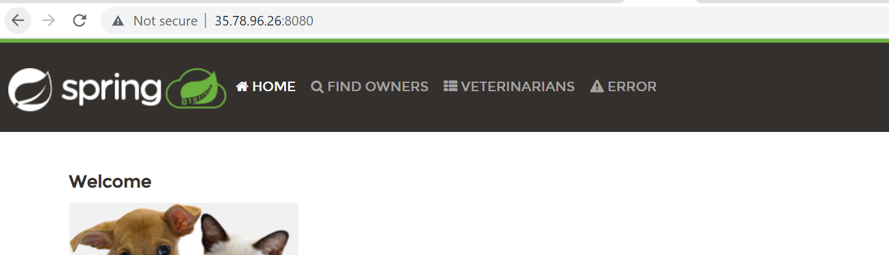

SPRING PET CLINIC
------------------
Manual steps:


to create spc package
```
sudo apt update
sudo apt install openjdk-17-jdk
sudo apt install maven -y
git clone https://github.com/spring-projects/spring-petclinic.git
cd spring-petclinic
mvn package
```
to install aws cli
```
sudo apt-get update 
sudo apt-get install -yy less
sudo apt-get install curl
sudo apt-get install unzip
curl "https://awscli.amazonaws.com/awscli-exe-linux-x86_64.zip" -o "awscliv2.zip"
unzip awscliv2.zip
sudo ./aws/install
```
to configure aws

```
aws configure
AWS Access Key ID [None]: 
AWS Secret Access Key [None]: 
Default region name [None]: 
Default output format [None]: json

```

* to push the package into aws s3 [Refer here](https://qiita.com/alokrawat050/items/56820afdb6968deec6a2)


* now edit the service file
* cd /etc/systemd/system
* sudo vi spc.service
```
[Unit]
Description=Manage Java service

[Service]
WorkingDirectory=/home/ubuntu
ExecStart=java -jar spring-petclinic-3.0.0-SNAPSHOT.jar
Type=simple
Restart=on-failure
RestartSec=10

[Install]
WantedBy=multi-user.target

```
sudo systemctl enable spc.service
 sudo systemctl start spc.service
 sudo systemctl daemon-reload
 sudo systemctl status spc.service
```
